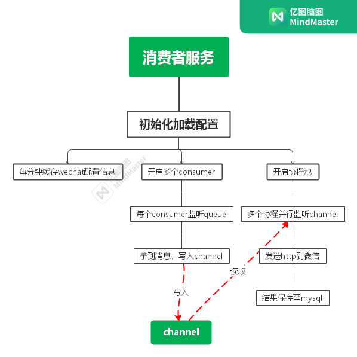
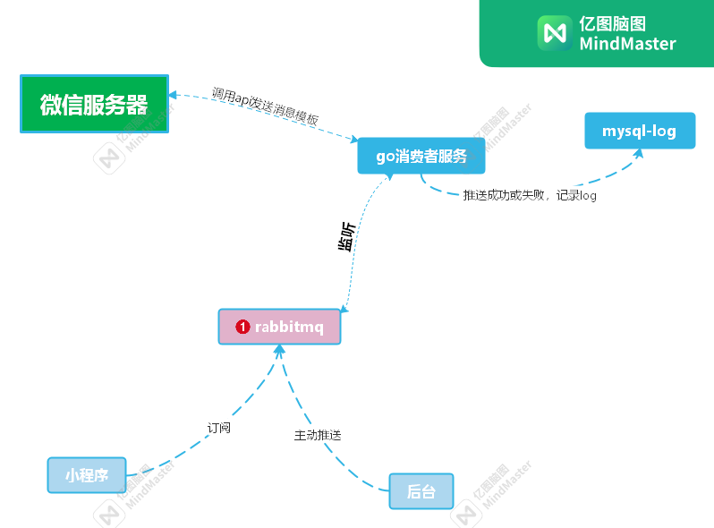

# wechat-template-msg

## 📖 简介

`wechat-template-msg`是一个并行发送微信模板的服务。通过启动多个消费者，监听`rabbitmqmq`
队列，将消息写入chan，在消费者服务启动时，开启一个携程池，并行消费chan内的数据。

接受json消息，处理结果写入mysql`db_wechat`->`t_wechat_template_msg`

## 快速入门

1. 修改`config.yaml`中`mysql、rabbitmq`链接
2. 修改`wechat-template-msg.service`中部署路径
3. 接入`database`中`t_wechat_conf、t_wechat_template_msg`mysql数据表，请自行维护assessToken有效期 
4. 本项目使用`gf`交叉编译 **(可跳过)**
5. 请将编译后文件移到项目根目录
6. 已提供3个简单生产者数据示例，生产使用请接入生产者项目发送正式消息

## 服务打包

```bash
gf build
```

## 消费者命令

#### 临时开启

```bash
./wechat-template-msg consumer
```

#### ps查看

```bash
ps aux | grep wechat-template-msg
```

#### 强行关闭

```bash
kill -9 PID
```

#### 配置系统命令systemctl

```bash
cd /etc/systemd/system
rz wechat-template-msg.service
```

#### 系统命令-开启（守护进程）

```bash
systemctl start wechat-template-msg
```

#### 系统命令-关闭

```bash
systemctl stop wechat-template-msg
```

#### 系统命令-状态

```bash
systemctl status wechat-template-msg
```

#### 系统命令-开机自启

```bash
systemctl enable wechat-template-msg
```

## 消费者监听消息格式

| 参数                               | 是否必填 | 类型     | 描述                 |
|----------------------------------|------|--------|--------------------|
| wechat_id                        | 是    | int    | 微信应用id             |
| wechat_type                      | 是    | int    | 微信应用类型 1.公众号 2.小程序 |
| table_name                       | 是    | string | 为数据库表名，为后续分表预留     |
| officialaccount_template_message | 否    | json   | 公众号模板消息            |
| miniprogram_subscribe_message    | 否    | json   | 小程序模板消息            |

#### 发送公众号模板消息

officialaccount_template_message：公众号模板消息（[官方文档格式](https://developers.weixin.qq.com/doc/offiaccount/Message_Management/Template_Message_Interface.html#5)
）

```json
{
  "wechat_id": 1,
  "wechat_type": 1,
  "table_name": "t_wechat_template_msg",
  "officialaccount_template_message": {
    "touser": "OPENID",
    "template_id": "ngqIpbwh8bUfcSsECmogfXcV14J0tQlEpBO27izEYtY",
    "url": "http://weixin.qq.com/download",
    "miniprogram": {
      "appid": "xiaochengxuappid12345",
      "pagepath": "index?foo=bar"
    },
    "data": {
      "first": {
        "value": "恭喜你购买成功！",
        "color": "#173177"
      },
      "keyword1": {
        "value": "巧克力",
        "color": "#173177"
      },
      "remark": {
        "value": "欢迎再次购买！",
        "color": "#173177"
      }
    }
  }
}
```

#### 发送小程序模板消息

miniprogram_subscribe_message：小程序模板消息（[官方文档格式](https://developers.weixin.qq.com/miniprogram/dev/OpenApiDoc/mp-message-management/subscribe-message/sendMessage.html)
）

```json
{
  "wechat_id": 9,
  "wechat_type": 2,
  "table_name": "t_wechat_template_msg",
  "miniprogram_subscribe_message": {
    "touser": "OPENID",
    "template_id": "TEMPLATE_ID",
    "page": "index",
    "miniprogram_state": "developer",
    "lang": "zh_CN",
    "data": {
      "number01": {
        "value": "339208499"
      },
      "date01": {
        "value": "2015年01月05日"
      },
      "site01": {
        "value": "TIT创意园"
      },
      "site02": {
        "value": "广州市新港中路397号"
      }
    }
  }
}
```

## 生产者命令

本项目生产者只生成测试数据，已提供3个测试的json示例，**生产环境使用other项目**

* 公众号模板--跳转url  **getOfficialaccountTemplateUrlMessage**
* 公众号模板--跳转小程序 **getOfficialaccountTemplateMiniprogramMessage**
* 小程序模板 **getMiniprogram15SubscribeMessage**

#### 临时启动
```bash
./wechat-template-msg producer
```

## 代码流程图



## 项目架构图



## 开源协议

本项目遵循[MIT](./LICENSE)协议 , 请自由地享受和参与开源。